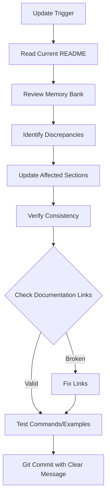

# README Update Workflow

The README.md serves as the project's front door - it's the first thing users, contributors, and future versions of Cline see when approaching the project. Keep it current, clear, and user-focused.

## When to Update README

README updates should occur when:
1. **Major features are completed** - New components, significant functionality changes
2. **Project structure changes** - New directories, reorganization, file moves
3. **Setup/installation steps change** - New dependencies, different installation process
4. **Architecture evolves** - Design improvements, new patterns adopted
5. **Milestones are reached** - Project status shifts (e.g., "In Progress" → "Complete")
6. **Usage instructions change** - New commands, different workflows
7. **User explicitly requests** with **update readme**

## Critical Sections (Priority Updates)

These sections are most important to keep current:

### 1. **Current Status** (HIGHEST PRIORITY)
- Users want to know "where are we now?"
- Update after every major milestone
- Keep aligned with `memorybank/progress.md`
- Shows active development and project health

### 2. **Setup & Installation**
- Users need this to be 100% accurate to get started
- Test installation steps after updates
- Include all dependencies and environment requirements

### 3. **Usage**
- Practical examples of how to use the project
- Commands must be current and tested
- Include both development and deployment scenarios

### 4. **Architecture/Design**
- Helps users understand the approach and design
- Update when architecture changes
- Keep implementation details high-level

## Common Update Scenarios

### Scenario 1: Feature Completion
```
Trigger: Completed feature verification and testing
Update Sections:
  - Current Status: Mark milestone as complete
  - Next Steps: Remove completed items
  - Usage: Add new commands if applicable
```

### Scenario 2: New Component Added
```
Trigger: New major component created and tested
Update Sections:
  - Overview: Mention new component
  - Project Structure: Add component to tree
  - Architecture: Add component description
  - Current Status: Update with component status
```

### Scenario 3: Directory Structure Change
```
Trigger: Added new directories or reorganized
Update Sections:
  - Project Structure: Update directory tree
  - Setup: Update paths if relevant to installation
```

### Scenario 4: Production Deployment
```
Trigger: First successful production deployment
Update Sections:
  - Current Status: Mark deployment milestone complete
  - Architecture: Add performance metrics if available
  - Usage: Update deployment section with real data
  - Next Steps: Focus on optimization/iteration
```

### Scenario 5: Dependencies Change
```
Trigger: New package required or removed
Update Sections:
  - Setup > Requirements: Update list
  - Setup > Installation: Update installation command
  - Tech Context: Verify consistency
```

### Scenario 6: User Requests "update readme"
```
Process:
  1. Read current README.md
  2. Review ALL memory bank files (especially progress.md, activeContext.md)
  3. Identify discrepancies between README and current project state
  4. Update all sections that are out of sync
  5. Focus on Current Status, Next Steps, and usage examples
```

## What NOT to Include in README

README should be **user-focused and accessible**. Avoid:

❌ **Overly Technical Implementation Details**
- Detailed algorithm pseudocode → Belongs in `docs/`
- Internal function documentation → Belongs in code comments
- Low-level optimization details → Belongs in `memorybank/systemPatterns.md`

❌ **Exhaustive Memory Bank Content**
- Active decisions and considerations → Keep in `memorybank/activeContext.md`
- Detailed architectural rationale → Keep in `memorybank/systemPatterns.md`
- Complete project history → Keep in `memorybank/progress.md`

❌ **Development Session Notes**
- Debugging sessions and fixes → Git commit messages
- "Currently working on..." → Keep in `memorybank/activeContext.md`
- Temporary blockers → Keep in `memorybank/progress.md` (Known Issues)

❌ **Verbose or Redundant Information**
- Repeating the same info in multiple sections
- Unnecessary background that doesn't help users
- Detailed explanations that belong in separate docs

✅ **What SHOULD be in README:**
- Project overview and purpose
- Quick setup instructions
- Clear usage examples
- Current status at a glance
- How to contribute or get help
- Links to detailed documentation

## Update Process



### Step-by-Step:

1. **Identify Trigger** - What changed that requires README update?

2. **Read Current README** - Understand current state

3. **Review Memory Bank** - Check latest project state
   - `progress.md` for current status and milestones
   - `activeContext.md` for recent changes
   - `systemPatterns.md` for architecture updates

4. **Compare and Identify Gaps** - What's out of sync?

5. **Update Affected Sections** - Make targeted changes
   - Keep changes focused and minimal
   - Maintain consistent tone and style
   - Update dates if sections have "Last Updated" notes

6. **Verify Consistency** - Cross-check related sections
   - Project Structure matches actual files
   - Status indicators consistent throughout
   - Next Steps align with Current Status

7. **Test Examples** - Ensure commands actually work
   - Run installation steps
   - Test usage examples
   - Verify file paths and links

8. **Commit Changes** - Clear, descriptive message
   ```
   git add README.md
   git commit -m "docs: update README - [what changed]"
   ```

## Consistency Checklist

When updating README, ensure consistency with:

- [ ] **Memory Bank Files** - Especially `progress.md` and `activeContext.md`
- [ ] **Actual File Structure** - Directory tree matches reality
- [ ] **Dependencies** - Requirements match what's actually installed
- [ ] **Commands** - All examples tested and work
- [ ] **Links** - All documentation links are valid
- [ ] **Status Indicators** - ✅ 🔄 📅 used consistently
- [ ] **Dates** - Update "Last Updated" or similar timestamps if present

## Key Principles

### User-Focused
- Write for someone discovering the project for the first time
- What do they need to know to get started?
- What do they need to know to contribute?

### Concise but Complete
- Balance detail with readability
- Link to detailed docs rather than including everything
- Use clear section headers for easy scanning

### Current Over Comprehensive
- Better to be accurate about current state than historically complete
- Focus on "what works now" and "what's next"
- Archive historical details in memory bank or git history

### Consistency
- Keep README aligned with memory bank
- Update both when significant changes occur
- README is the user view; memory bank is the detailed context

## Examples of Good Updates

### Good: Clear, Focused Update
```markdown
## Current Status

✅ **Complete**: Core feature implemented and tested
🔄 **In Progress**: Production deployment preparation
📅 **Planned**: Performance optimization and feature enhancements
```

### Bad: Too Verbose
```markdown
## Current Status

We have completed the implementation of the core feature after extensive
development which included multiple iterations. During this process we
discovered several issues which were subsequently resolved. The feature
is now ready for deployment pending final preparations which are currently
underway and should be completed soon...
```

## README as Living Document

Remember: README.md is a **living document** that evolves with the project.

- Don't let it get stale - update frequently
- Small, frequent updates > large, infrequent rewrites
- Keep it synchronized with the actual project state
- When in doubt, verify with the actual code and files

---

**Related Workflows**: `task_completion.md`
**Related Rules**: `documentation.md`
